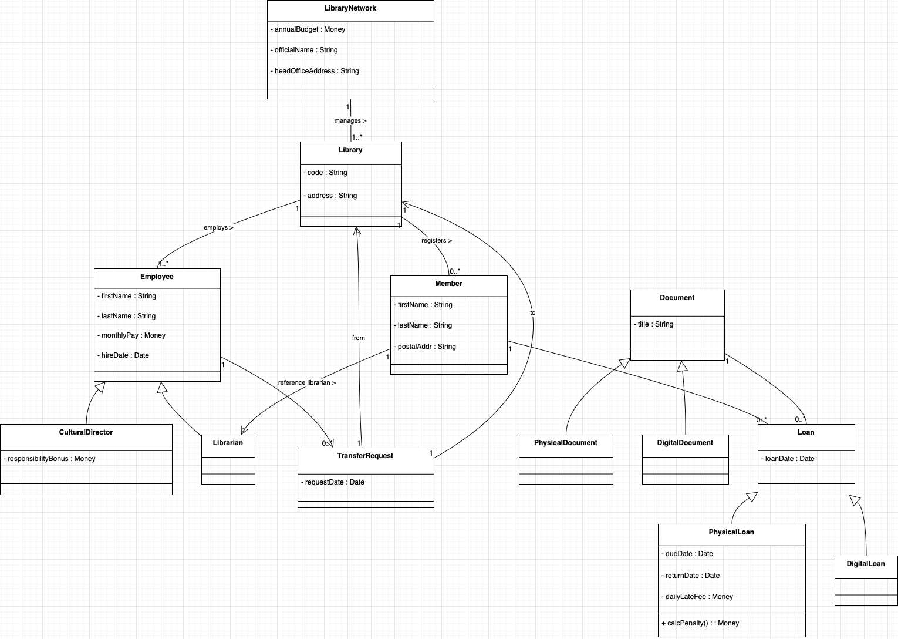
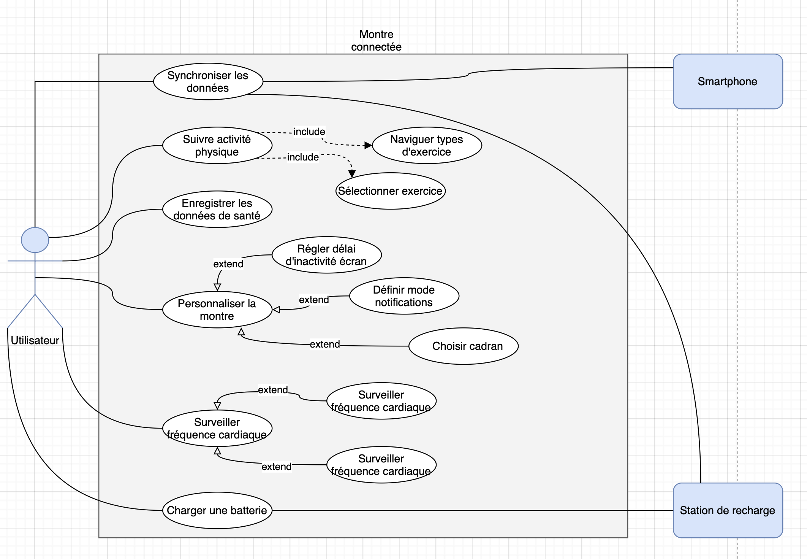

# 🛠️ Examen POO & Design Patterns (Java)

Ce dépôt contient **ma solution complète** à la partie “Programmation Orientée Objet et Design Patterns” de l’examen.  
L’objectif était de mettre en pratique plusieurs patrons de conception en Java 17 et de modéliser un second domaine via UML.

---

## ✨ Contenu de l’examen — résumé

| Partie  | Sujet | Exigences principales |
|:-------:| ----- | --------------------- |
| **A-1** | **Singleton – ActivityLogger** | Journal d’activité unique dans toute l’application : `logActivity()`, horodatage automatique, accès global. |
| **A-2** | **Factory – ProductFactory** | Création centralisée de trois produits (E1 📱, V1 🧢, A1 🍞) à partir d’une chaîne `"électronique" / "vêtement" / "alimentaire"`. |
| **A-3** | **Observer – Inventory** | `Inventory` notifie `SalesService` et `WarehouseService` à chaque ajout de produit. |
| **A-4** | **Intégration** | Classe `Main` qui :<br>1. crée les 3 produits via la factory ;<br>2. les ajoute à l’inventaire (notification automatique) ;<br>3. affiche le journal d’activités en fin d’exécution. |
| **B-1** | **Modélisation UML** | Diagramme de classes complet pour la gestion d’un _réseau municipal de bibliothèques_ (voir ci-dessous). |

---

## 🚀 Lancer le projet

Ce que vous verrez :
1. Les services de vente et de magasin recevront une notification pour chaque produit ajouté.
2. Le journal d’activités horodaté sera affiché à la fin.

---

## 📂 Arborescence du projet

```
./src/main/java/art/lapov
├── ActivityLogger.java      # Singleton
├── Product.java             # Classe abstraite + sous-classes
├── ProductFactory.java      # Factory
├── Inventory.java           # Observable
├── SalesService.java        # Observateur 1
├── WarehouseService.java    # Observateur 2
├── Main.java                # Intégration et démo

.
├── diagramme-1.png          # UML bibliothèque (Partie B-1)
├── diagramme-2.png          # UML bibliothèque (Partie B-2)
└── README.md
```

---

## 🖼️ Diagramme UML

### Réseau de bibliothèques municipales 



> _Diagramme de classes._

---
### Conception d'une montre connectée



> _Diagramme de cas d'utilisation._

